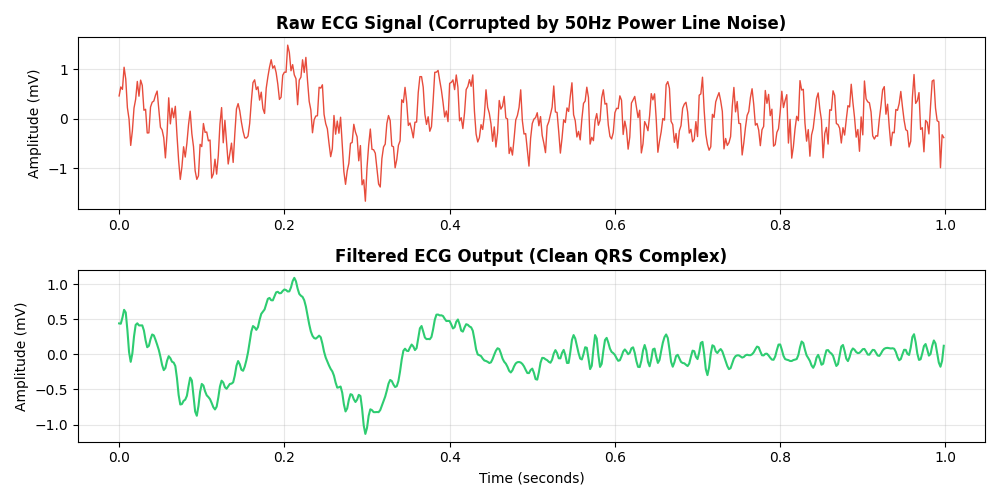

# Real-Time ECG Signal Processing (Pan-Tompkins)

A two-layer ECG signal processing pipeline implementing the **Pan-Tompkins QRS detection algorithm** in C for embedded real-time use, with a Python preprocessing and visualization layer for signal generation and validation.


*Top: Raw ECG corrupted by 50Hz powerline interference and random noise | Bottom: Cleaned QRS output*

## Overview

ECG signals are routinely corrupted by two noise sources: 50Hz powerline hum from mains electricity, and baseline wander from patient movement. This project implements a full pipeline to remove both and reliably detect heartbeats (QRS complexes) in real time — the same approach used in clinical cardiac monitors.

## Architecture

**Python layer (`generate_ecg.py`) — Preprocessing & Validation**
- Generates a synthetic ECG signal (Gaussian pulse QRS at 60 BPM, 500 Hz sample rate)
- Adds 50Hz powerline interference and random noise
- Applies IIR Notch Filter (removes exactly 50Hz) followed by Butterworth Lowpass (cutoff 100Hz)
- Saves `ecg_results.png` for visual validation

**C layer (`ecg_processor.c`) — Real-Time Pan-Tompkins Pipeline**

The core algorithm runs sample-by-sample, making it suitable for embedded deployment (microcontrollers, DSPs). Five stages in sequence:

1. **Lowpass Filter** — difference equation implementation suppressing high-frequency noise above ~15Hz
2. **Highpass Filter** — removes baseline wander (slow drift below ~5Hz)
3. **Derivative** — computes signal slope to highlight the steep edges of QRS complexes
4. **Squaring** — rectifies and amplifies large slopes, suppresses small ones nonlinearly
5. **Moving Window Integration** — smooths the squared derivative over a fixed window to produce a clean envelope

The output of stage 5 is fed into an **adaptive threshold state machine** that detects beats:
- If the integrated signal exceeds the threshold → beat detected, refractory period starts (200ms blanking to ignore T-waves)
- Signal level and noise level estimates update continuously using exponential averaging
- Threshold adapts automatically: `threshold = noise_level + 0.25 × (signal_level − noise_level)`
- Signal level decays slowly to handle dropped beats

## Tech Stack

- **Core algorithm:** C (embedded, sample-by-sample, no dynamic allocation)
- **Preprocessing & visualization:** Python (NumPy, SciPy, Matplotlib)
- **Filters:** IIR Notch, Butterworth Lowpass (Python) + Pan-Tompkins LP/HP/Derivative/MWI (C)
- **Sample rate:** 360 Hz (C core), 500 Hz (Python layer)

## Key Design Decisions

**Why C for the core?** Pan-Tompkins must process each sample as it arrives with minimal latency. C gives deterministic execution time with no garbage collection or interpreter overhead — essential for real-time cardiac monitoring.

**Why an adaptive threshold?** A fixed threshold breaks when signal amplitude varies (electrode placement, patient movement). The exponential averaging approach continuously tracks both signal and noise levels and adjusts the detection threshold accordingly.

**Why a refractory period?** After a QRS complex, the heart produces a T-wave ~200ms later that can look like another QRS to a naive detector. The 200ms blanking window prevents T-wave double-counting.

## How to Run

**Python preprocessing (generates test signal and result image):**
```bash
pip install numpy scipy matplotlib
python generate_ecg.py
```

**C core (compile and run):**
```bash
gcc main.c ecg_processor.c -o ecg_processor -lm
./ecg_processor
```

## File Structure

| File | Purpose |
|---|---|
| `generate_ecg.py` | Signal generation, notch/lowpass filtering, visualization |
| `ecg_processor.c` | Pan-Tompkins pipeline + adaptive QRS detector |
| `ecg_processor.h` | Context struct and function declarations |
| `main.c` | Test harness feeding samples through the C pipeline |
| `ecg_results.png` | Visual output from Python layer |
